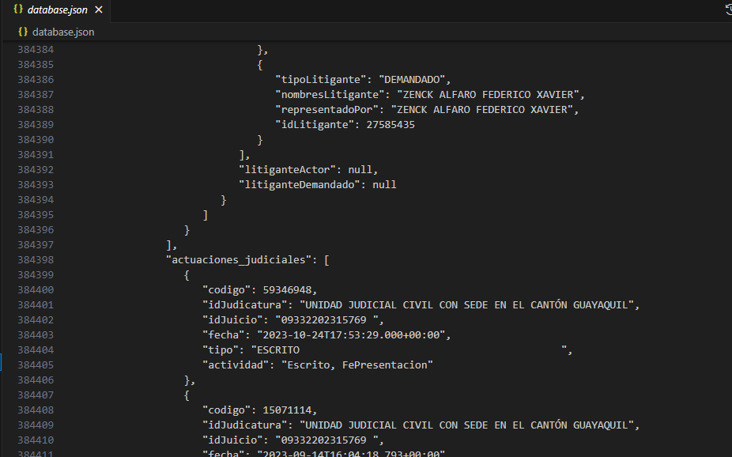

# Prueba técnica Desarrollador Backend Python

## WEB SCRAPING
Para realizar la extracción de los datos, se hizo un proceso de ingeniería inversa del portal web y se determinó que las APIs que éste emplea en su backend.

### Técnicas de extracción de datos
Dado que en ocasiones las apis suelen bloquear las peticiones, se implementó un proxy residencial de Ecuador, el cual tiene un TTL y va rotando para evitar realizar las peticiones con la misma IP, permitiendo así consultas de forma masiva, de igual forma, se implementó una lógica de reintentos para los requests que se realizan.

### Logs
Para hacer seguimiento del funcionamiento de los scripts, se crearon dos bases de datos (archivos .json) para registrar los errores, estos son:

requests_errors.json : Allí se registran los errores en caso de que alguna de las peticiones no se pueda realizar de forma correcta en la cantidad de reintentos especificada.

errors.json: En este archivo se registran los errores internos del servidor, ya que para algunos registros, las APIS retornan un error interno del backend, aún retornando un código 200.

### Base de datos
Para el almacenamiento de la información, se utilizó un archivo .json, el cual es administrado haciendo uso de la librería pysondb, para tratar dicho archivo como una base de datos, permitiendo así realizar operaciones CRUD con mayor fiabilidad:

### Casos de prueba
En cuanto a las pruebas de ejecución en paralelo de los servicios consultarDemandado y consultarDemandante, se ejecutan 15 peticiones en paralelo al respectivo endpoint, haciendo uso de un script en javascript ejecutado en un servidor local de nodeJs. Para validar que la información fue extraída correctamente, se valida al finalizar la prueba, que no hay registros en la base de datos de errores (request_errors.json).

La documentación de estas pruebas, puede ser visualizado en documentacion_pruebas.pdf (/documentacion_pruebas.pdf)

## API

Para el desarrollo del API se implementaron las librerías Flask y APIFlask. De igual forma, marshmallow para la validación de los campos.

La documentación del uso del API puede encontrarse en el endpoint:
http://127.0.0.1:5000/apiDoc y en https://app.swaggerhub.com/apis/ortizjeison/my-project/1.0.0

### Autorización y autenticación
Se implementó una autenticación básica, en este caso, los usuarios registrados y sus contraseñas se encuentran en el código (No replicar, es una mala práctica):

usuario:contraseña

userA:I_know_this_is_a_bad_practice

userB:So_I_Do

## Frontend

Para la vista se desarrolló el endpoint /verResultados, el cual recibe un documento y un tipo de consulta (demandado, demandante). Luego de recibir la petición, se ejecuta el script que realiza las consultas, y finalmente se renderiza las respuestas de forma tabular, este proceso puede tomar unos cuantos minutos, dependiendo la cantidad de registros.

## Instalación:
1. Crear un ambiente virtual de python
2. Activar el ambiente virtual
3. Instalar las dependencias (ver requierements.txt)
4. Ejecutar el API (flask run --reload)

## Authors

- [Jeison Fernelix Ortiz López](https://github.com/ortizjeison)

